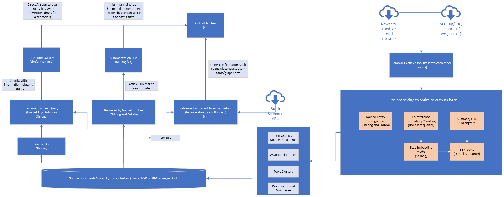

# FinBot

*TODO: Add table of content*

## Project Description
The FinBot uses large language models and Natural Language Processing (NLP) to analyze news articles and provide insights to retail investors. The application allows users to stay informed about potential hypes and important events by analyzing a specified time period of news articles.

## Target Audience and Main Use Case
FinBot was developed with specifically the retail investors in mind. Compared to dedicated asset managers, retail 
investors do not have the time nor exposure to do a comprehensive research into the current hot areas that may be of 
interests from an investment perspective. In addition, concerning very specific industries, such as the pharmaceutical 
ones, some domain knowledge may be required to extract the key information from the articles. Thus, by leveraging the LLMs,
FinBot can enpower the retail investors to have some support in getting key news information for their investment.

## Main Features
- Answer any questions about recent business news and developments to stay well informed
- Summarizing contextual information from different perspectives to present a big picture
- Automatically extracting relevant metrics from companies based on user interests
- *TODO: Add more as we develop it further*

## TODO: @Yif Add UI demo video/image/gif once ready

## Architecture/Tech

### TODO: Make it more presentable

### Tech Stack

#### Data Scraping
- Selenium and/or Requests
- Yahoo Finance API via yfinance

#### Data Storage
- GCP Cloud Storage (scraped articles, intermediary results)
- Elastic Search (Processed topics/article chunks)

#### Model/Deployment
- HuggingFace
- Langchain
- Flask

#### UI
- Streamlit

### Data Enrichment

#### Web Scraping for Data Collection ([scraper](scraper))
- We've gathered data from prominent news sources, including CNBC, The New York Times, and Reuters, as part of the data collection phase. The [common.py](scraper/common.py) is a framework that serves as the backbone for the web scraper. It encapsulates the essential functionality of traversing HTML pages by following links, verifying if a URL has already been scraped, and progressing to the subsequent page.
- The [cnbc_requests.py](scraper/cnbc_requests.py), [nyt_requests.py](scraper/nyt_requests.py) and [reuters_requests.py](scraper/reuters_requests.py) scripts are dedicated scrapers designed for their respective news sources, employing the '[lxml](https://lxml.de/)' module to extract key information such as article sections, titles, publication timestamps, article bodies, and optional summaries.
- News articles spanning from March 2008 to September 2023 have been scraped and collected for the project.

#### Consolidating all the news articles
- The [consolidate_scraper_1.py](pipeline/consolidate_scraper_1.py) script serves as the central hub for aggregating and formatting news articles gathered from various sources.

#### Monthly Data Segregation
- The [select_data_2.py](pipeline/select_data_2.py) script partitions the data into separate segments, dividing it on a monthly basis. These segments are then stored in distinct Parquet files.

#### Deduplication of the news articles
- The dataset includes duplicate articles, which may be attributed to either the scraper's behavior or the occurrence of similar news articles from different sources.
-  Eliminating these duplicate news articles is crucial to improve efficiency, prevent potential biases caused by redundant information, and ensure a more accurate representation of the data.
-  In this context, we've employed the MinHash LSH technique to effectively eliminate duplicate news articles from the dataset.

#### Coreference Resolution for Text Simplification
- The [coref_resolve_4.py](pipeline/coref_resolve_4.py) script utilizes a list of coreference clusters to transform a Spacy document into a string. In this transformation, each coreference is replaced with its primary mention, enhancing the clarity and coherence of the text.

#### Topic Modelling
- The primary objective of topic modeling ([extract_topics_5.py](pipeline/extract_topics_5.py)) is to ensure the retrieval of a diverse set of content segments. Typically, in semantic search, there's a possibility that the top segments retrieved could be quite similar. However, by introducing topics, it compels the system to select segments that cover distinct facets or angles of the subject matter, promoting a more comprehensive and well-rounded result set.
- Here, the topic modeling is done using BERTopic.

#### Topic Summarizer
- The [summarize_topics_6.py](pipeline/summarize_topics_6.py) generates concise and coherent summaries of news articles for each topic. It is designed to extract and condense key information from a set of documents or articles related to a specific topic or subject.
- Topic summarizers aim to provide users with a quick and informative overview of the most important points within a particular subject area, making it easier to understand and extract insights from a large volume of text. 

#### Index Creation
*TODO: Add Elastic Index once the code is stable*

### Response Generation

The algorithms for handling output is located in the [summarizer](summarizer) directory.

*TODO: Touch Up once done*

#### Retrieval
- A topic based retrieval strategy is used for QA/Summarization.
- First, the top T relevant topics are found via a semantic similarity search of user query against topic embedding (summary of topics)
- Then, for each relevant topics, the top K text chunks from the topic is found via a combined score of full text search (entities, raw text, titles) and chunk embeddings (MMR)
- While searching, the chunks are constraint according to user specified time-frame

*TODO: Make diagram for algorithm*

#### Generation
- A custom fine-tuned summary model on the article summaries is used with the retrieved chunks to generate the key-points summaries
- A model fine-tuned on reading comprehension based free-form QA is used to directly answer the user query
- Raw text generation is enriched via public metrics such as P/E ratio, Cashflow etc based on entities found in query and generated output
- *TODO: Add more details once done*

### Model Improvements

*TODO: Add hyper-parameters and more details on evaluation strategy when model finalizes*

#### Text Embedding
The [ember-v1](https://huggingface.co/llmrails/ember-v1) model is used as a base for creating the embeddings for retrieval. 
In order to make it more tailored to retrieving chunks based on questions that a retail investor may ask, the model was 
fine-tuned on the [FIQA](https://sites.google.com/view/fiqa/home) dataset. The post-finetune results for K=2 and K=3 on the FIQA test set are given below.

| K/Metrics | Accuracy@K | Precision@K | Recall@K | NDCG@K   | MRR@K    | MAP@K    |
|-----------|------------|-------------|----------|----------|----------|----------|
| 2         | 0.791667   | 0.710648    | 0.377674 | 0.713267 | 0.756944 | 0.693287 |
| 3         | 0.828704   | 0.618827    | 0.461880 | 0.698001 | 0.769290 | 0.659422 |

#### Summarization
The FLAN-T5 models is used as a base for creating key-point summaries. In order to make it generate more text than 
the pre-training data, and also to produce the format that we requires, the model was fine-tuned on the key-points created by 
human writer from the scraped articles. The final results are given below.

#### Question Answering
@Shefali, @Takuma Add once done

## Future Work

*TODO: See how far we get*
