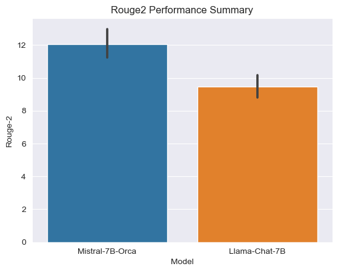
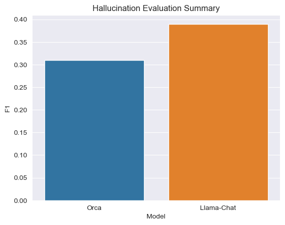

# FinBot

## Table of contents
1. [Demo](#demo)
2. [About FinBot](#background)
   1. [Industry Research](#industry_research)
   2. [Project Mission](#mission)
   3. [Current Features](#features)
3. [Project Implementation](#implementation)
   1. [Architecture](#architecture)
   2. [Data Ingestion](#ingestion)
   3. [Output Generation](#generation)
   4. [Model Improvements](#model)
4. [Next Steps](#next)

## Demo 

TODO

## About FinBot 

FinBot is an AI driven web application capable of analyzing financially related news articles and provide 
insights to retail investors. The application can empower the users to make better investment decisions while saving 
time and money by letting leveraging the power of LLM and retrieval augmented generation.

### Industry Research 

TODO

### Project Mission 

As a retail investor with a diverse set of interests, there are many challenges to overcome in accomplishing 
investment goals.

#### The Unknown Unknown

While retail investors can be capable of understanding the big picture, they generally do not have the time 
nor the exposure to conduct comprehensive research to make specific investment decisions. For instance, 
when COVID hit, it can be apparent that companies related to making remote work possible would be benefited from the 
situation. However, in addition to the consumer facing 
products such as Zoom, the products further upstream such as various cloud hosting services, data center properties, 
and chip manufacturers also experienced a boost in demand. However, for the retail investors, unless the area 
happens to fall into their expertise, such information may be an unknown unknown to them.

#### Staying up-to-date

Investment opportunities are time-dependent and require up-to-date information. But, staying up-to-date while life 
happens require constant effort. Suppose that an investor is interested in pharmaceutical sector, but making informed 
decision regarding the pharmaceutical industry would potentially entail keeping track of the development and approval 
process of treatment procedures. But, not everyone has the 
time or energy to scan through news and documents on medical procedures after a long day at work and taking care 
of family matters.

#### Democratizing the Market

Generic ETFs and mutual funds are common solutions employed by retail investors to get a decent return without 
having expert knowledge. Thus, the asset managers or index tracking algorithms are making decisions on behalf of a large 
number of retail investors. In recent years, the growth of ESG suggests that investors may have additional interests, 
such as delivering social impact, by means of their investment. In addition, getting financial advice can be costly, 
and the interest of the hired advisor may not truly be aligned with the interest of the investor.

The aim of the project is to alleviate those pain-points by reducing the information asymmetry that leads to less efficient 
investment choices by retail investors compared to a dedicated advisor or asset manager. Utilizing the power of AI, we provide 
our users the power to quickly digest facts and insights from the vast collection of publically available financial news 
articles 

### Current Features

The main features for the project ordered by priority is given below:

1. Answer any questions about business news and developments in a time frame
2. Summarize contextual information from different perspectives
3. Automatically pulling relevant financial metrics from companies
- *TODO: Add more as we develop it further*

## Project Implementation

In order to accomplish the goal of the project, the features can be seen as retrieval augmented generation problems. 
While LLMs may encode prior knowledge from pre-training, it is difficult to control and to ensure the correctness of 
the output. In addition, the prior knowledge of the model stops at the date when the pre-training stopped. Thus, 
for the purpose of assisting the users with market research and advice, the approach taken was to create an envelope 
around LLMs, feed the LLMs data required to perform tasks pretaining to the features, and make use of the domain knowledge 
and reasoning ability of the LLMs to create the outputs for the users.

### High Level Process Flow

Our work to implement the process can be roughly divided into three main parts:

- Data Ingestion: Scraping news articles and enriching them with additional information
- Model Improvements: Fine-tuning the LLMs to achieve desired performance and output format
- Output Generation: Generating outputs via LLMs and augmenting the output with additional information

### Data Ingestion

The data collection pipeline collects and aggregate news articles. Then, it applies a series of NLP techniques including 
co-reference resolution, topic modeling, text embedding, NER, and Min-Hash to augment the articles. Finally, it prepares 
the articles for output generation by chunking the article texts and indexing the chunks.

#### Web Scraping for Data Collection ([scraper](scraper))
- We've gathered data from prominent news sources, including CNBC, The New York Times, and Reuters, as part of the data collection phase. The [common.py](scraper/common.py) is a framework that serves as the backbone for the web scraper. It encapsulates the essential functionality of traversing HTML pages by following links, verifying if a URL has already been scraped, and progressing to the subsequent page.
- The [cnbc_requests.py](scraper/cnbc_requests.py), [nyt_requests.py](scraper/nyt_requests.py) and [reuters_requests.py](scraper/reuters_requests.py) scripts are dedicated scrapers designed for their respective news sources, employing the '[lxml](https://lxml.de/)' module to extract key information such as article sections, titles, publication timestamps, article bodies, and optional summaries.
- News articles spanning from March 2008 to September 2023 have been scraped and collected for the project.
- The scrapers dump the scraped articles into BigQuery

#### Deduplication of the news articles
- The dataset includes near duplicate articles, which may be attributed to either the scraper's behavior or the occurrence of similar news articles from different sources.
- Eliminating these duplicate news articles is crucial to improve efficiency, prevent potential biases caused by redundant information, and ensure a more accurate representation of the data.
- In this context, we've employed the MinHash LSH technique to effectively eliminate duplicate news articles from the dataset.

#### Coreference Resolution
- The [coref_resolve_4.py](pipeline/coref_resolve_4.py) script utilizes a list of coreference clusters to transform a Spacy document into a string. 
- In this transformation, each coreference is replaced with its primary mention
- More emphasis on named entities, and preserves context on text chunking

#### Topic Modelling
- The primary objective of topic modeling ([extract_topics_5.py](pipeline/extract_topics_5.py)) is to ensure the retrieval of a diverse set of content segments. 
- Typically, in semantic search, there's a possibility that the top segments retrieved could be quite similar. However, by introducing topics, it compels the system to select segments that cover distinct facets or angles of the subject matter, promoting a more comprehensive and well-rounded result set.
- BERTopics is used to utilize the power of embeddings
- The [summarize_topics_6.py](pipeline/summarize_topics_6.py) generates concise and coherent summaries of the theme for each topics

#### Text Chunking & NER
- In order to make the most out of the context window for the LLMs, the article texts are split into chunks of up to 256 tokens
- The chunk boundaries are determined by first splitting the text into sentences using Spacy, then merging the sentences.
- For each chunks, a list of named entities are extracted using Spacy to allow for matching by entity during output generation.
- The main processing code for this section is in the [build_vector_index_7.py](pipeline/build_vector_index_7.py)

#### Index Creation/Text Embedding
- Once all of the enrichment techniques are applied, a sentence transformer model is applied to each text chunk to create the associated embedding
- Next, for each topic found, the summaries of the topics are converted into embeddings for relevant topic identification
- An elastic search index containing the following information would be created for topic retrieval
  - Topic Number
  - Topic Summary
  - Topic Summary Embedding
  - Median Publication Date of Top Articles
- An elastic search index containing the following information would be created for article text chunk retrieval
  - Text Chunk Text
  - Text Chunk Embedding
  - Entities in Chunk
  - Topic Number of the Chunk
  - Publication Date
- The associated code is located in [build_vector_index_7.py](pipeline/build_vector_index_7.py)

Once the indices are built, the solution is ready to generate output for the users.

### Output Generation

The final output to the user consists of three main segments:
- Direct answer to user query
- Key-points/Insights from Top Topics Relevant to User Query
- KPIs of companies related to the query and generated outputs

The algorithms for handling output is located in the [summarizer](summarizer) directory.

*TODO: Touch Up once done*

#### Retrieval
- A topic based retrieval strategy is used for QA/Summarization.
- First, the top T relevant topics are found via a semantic similarity search of user query against topic embedding (summary of topics)
- Then, for each relevant topics, the top K text chunks from the topic is found via a combined score of full text search (entities, raw text, titles) and chunk embeddings (MMR)
- While searching, the chunks are constraint according to user specified time-frame

#### Generation
- A custom fine-tuned summary model on the article summaries is used with the retrieved chunks to generate the key-points summaries
- A model fine-tuned on reading comprehension based free-form QA is used to directly answer the user query
- Raw text generation is enriched via public metrics such as P/E ratio, Cashflow etc based on entities found in query and generated output
- The Streamlit UI combines the QA generation, the summarized key-points, and the KPIs in a coherent page for the user.

### Model Improvements

In addition to creating envelops around LLMs, we customized the pre-trained models. We require the following models for 
our solution:

- Embedding Model: A model capable of vectorizing the text such that the distance between queries and relevant chunks would be minimized
- QA Model: A LLM capable of directly answering the query of the user given retrieved chunks
- Targeted Summarization Model: A LLM capable of summarizing the key-points of chunks relevant to the query

In order to fulfill the modeling requirements, we conducted an initial evaluation of pre-trained models to determine the 
best one to fine-tune (if needed). Next, we fine-tuned the models gathered data to improve the performance and to get the 
desired output format. Then, we evaluated the fine-tuned models on a separate test dataset to determine if the tuned models 
meet our ends. Finally, the fine-tuned models are deployed on GCP to serve our clients.

#### Text Embedding
The [ember-v1](https://huggingface.co/llmrails/ember-v1) model is used as a base for creating the embeddings for retrieval. The ember-v1 model is the best 
non-instructed tuned embedding model for retrieval task on the HuggingFace MTEB Leaderboard. Thus, we have determined that 
it would achieve a good balance of performance and simplicity to start our fine-tuning.

In order to align the generated embeddings with financially related queries and text, we sourced and augmented the 
[FIQA](https://sites.google.com/view/fiqa/home) dataset, which contains questions and answer paragraph pairs on financially related subjects. Since the original 
FIQA dataset was created by scraping questions asked on forums such as stackexchange and reddit, we augmented the train, 
eval, and test split of the dataset separately by prompting PaLM2 chat-bison to re-write the answer paragraph in a formal 
way adhering to the convention of news and/or reports.

The fine-tuning followed a standard train-eval loop for 10 epochs on the FIQA train/eval splits. The default hyper-parameters 
from sentence transformers were applied. After running through the 10 epochs, checkpoint with the best max(MAP@2, MAP@3) score 
was selected. In this case, the first epoch resulted in the best performing model.

Since for our purposes, we would only retrieve the top 2-3 chunks given the constraints on the context window, we evaluated 
the model performance with K = 2 and K = 2. The following metrics were computed on the test set from FIQA.

##### Performance Before Tuning

| K/Metrics | Accuracy@K | Precision@K | Recall@K | NDCG@K   | MRR@K    | MAP@K    |
|-----------|------------|-------------|----------|----------|----------|----------|
| 2         | 0.762346   | 0.672840    | 0.359836 | 0.678078 | 0.729167 | 0.656250 |
| 3         | 0.807099   | 0.584362    | 0.440857 | 0.663874 | 0.744084 | 0.620971 |

##### Performance After Tuning

| K/Metrics | Accuracy@K | Precision@K | Recall@K | NDCG@K   | MRR@K    | MAP@K    |
|-----------|------------|-------------|----------|----------|----------|----------|
| 2         | 0.791667   | 0.710648    | 0.377674 | 0.713267 | 0.756944 | 0.693287 |
| 3         | 0.828704   | 0.618827    | 0.461880 | 0.698001 | 0.769290 | 0.659422 |

In general, we were able to improve the embedding model performance by a few percentage points for each metric.

#### Targeted Summarization

##### Model Selection

For our summarization model, we used the scraped articles as a foundation to pick, train, and evaluate the models. Since 
the goal is to generate key-points for the user, we decided to let the model mimic the human-written key-points summaries 
generally found together with the financially related news articles. The final aggregated news dataset consists of ~50K 
articles in the training set, and 1000 articles in the test set. We excluded the evaluation set for this model because 
we did not tune hyper-parameters for the fine-tuning. Since the scraped data would not contain potential questions that the 
users would ask for the targeted summaries, we augmented the data by using PaLM2 chat-bison to come up with a question that 
a retail investor might ask with an answer found in the article, and a different question where it would be impossible to 
answer with information contained in the article. For the impossible case, we set the output summary to be "IMPOSSIBLE."

After considering the ease of deployment, the advancements in model architecture, and the availability of supportive 
infrastructure such as VLLM, we arrived at 2 candidate model for targeted summaries. The first candidate was the chat version 
of the Llama-2 7B model. The second candidate, Open-Orca Mistral-7B was one of the top performer on the HuggingFace 
LLM leaderboard. We evaluated the base model on our targetted summaries test split by considering the ROUGE-2 Score on instances 
where both the predicted and actual summaries are not "IMPOSSIBLE", and the 
ability of the model to classify the case when it's impossible to create the targeted summary. 

From our initial evaluation, we determined that while both models did not meet our expectations on identifying impossible 
cases via a prompt engineering approach, Mistral is closer to our goal from an output perspective. Furthermore, Mistral 
has proven itself on the Huggingface Leaderboard. Thus, we decided to move forward with Open-Orca-Mistral7B.

##### Model Finetuning

We fine-tuned the Mistral model on the training split of our article dataset using half-precision LORA with the following hyper-parameters:
- Epoch: 4
- Learning Rate: 0.0001
- Effective Batch Size: 4
- Weight Decay: 0.1
- Learning Rate Schedule: Cosine
- Learning Rate Warmup: 200 Steps
- LORA rank: 16
- LORA dropout: 0.05
- LORA target: q_proj, k_proj, v_proj, o_proj

The performance comparison after tuning is given below:

After fine-tuning, both the ROUGE-2 score and F1 score for identifying impossible case increased drastically. Furthermore, 
the recall for identifying the impossible case was 98% on the test set. Thus, the model errs more on the side of false 
positives, which is acceptable since we do not want to provide potentially false information.

#### Question Answering
@Shefali, @Takuma Add once done

## Future Work

*TODO: See how far we get*
