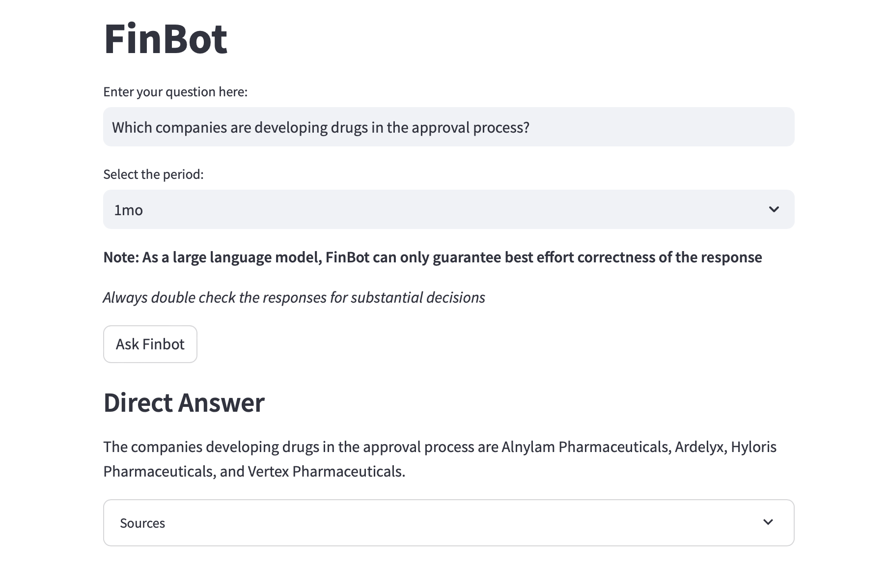
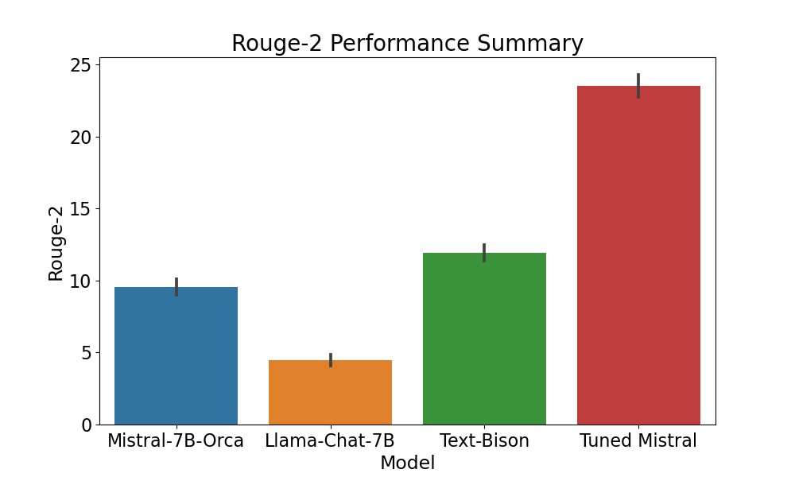
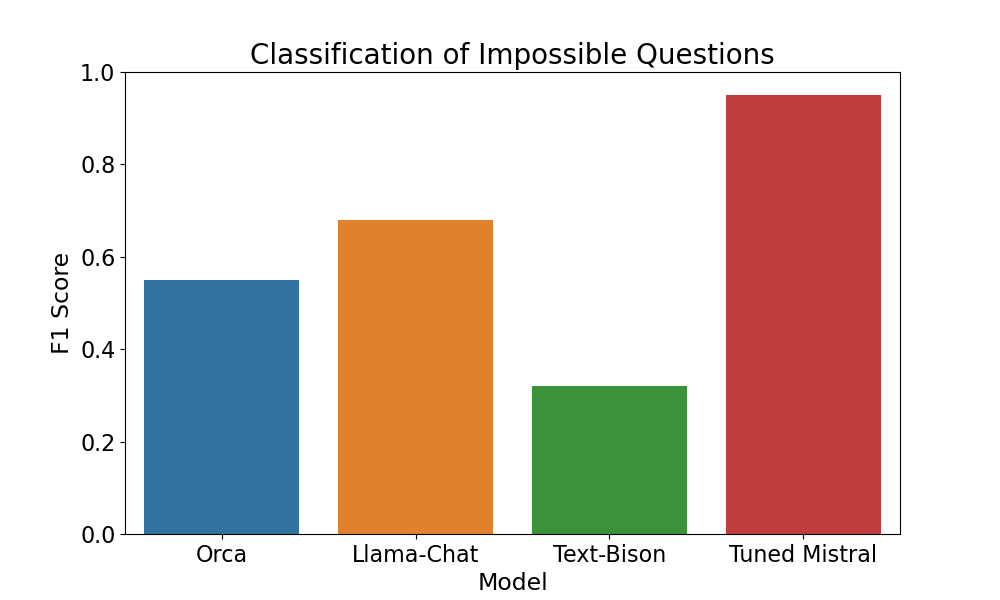
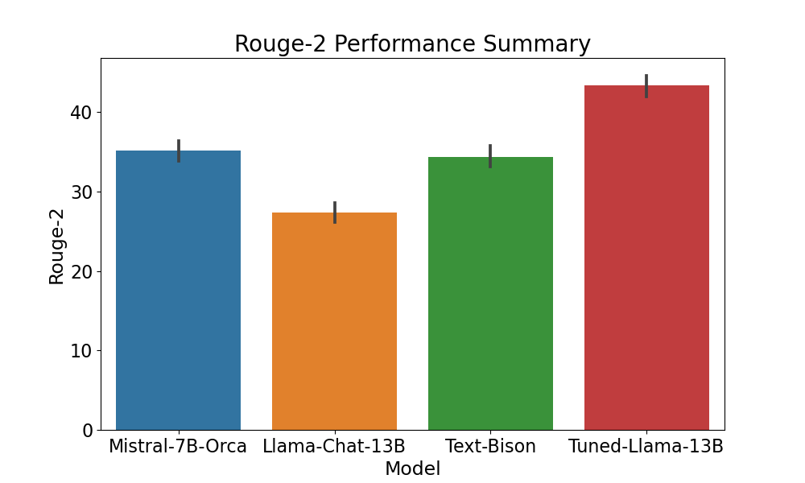

# FinBot

## Table of contents

1. [Demo](#demo)
2. [About FinBot](#background)
    1. [Why FinBot?](#why)
    2. [Project Mission](#mission)
    3. [Current Features](#features)
4. [Project Implementation](#implementation)
    1. [Architecture](#architecture)
    2. [Data Ingestion](#ingestion)
    3. [Output Generation](#generation)
    4. [Model Improvements](#model)
5. [Future Work](#next)

## 1. Demo 

https://github.com/yw4401/FinBot/assets/54665534/8e59fa43-9706-4af5-8bb3-4c6c8998292b

## 2. About FinBot 

FinBot is an AI driven web application capable of analyzing financially related news articles and providing
insights to retail investors. The application can empower the users to make better investment decisions while saving
time and money by leveraging the power of LLM retrieval augmented generation.

### 2.1 Why is FinBot necessary ? 

#### 2.1.1 Time Constraints and the Demand for Timely Information

The modern retail investor faces a dilemma—a scarcity of time to delve into extensive research while needing to stay
updated with the dynamic opportunities in the market. The pace of change in investment landscapes demands continuous
vigilance, making it challenging for individuals to keep pace with market shifts and opportunities.

#### 2.1.2 High Costs Linked to Traditional Financial Advisors

Traditional financial advisory services often come with steep costs, sometimes ranging into hundreds of dollars per
hour. This financial barrier restricts access to expert guidance and tailored advice, especially for smaller investors
or those looking for cost-effective solutions.

#### 2.1.3 Steady Growth in Assets Under Management

The market reflects consistent growth in assets under management, showcasing a compound annual growth rate of around 9%.
This expansion indicates an increasing interest and engagement in investing but also amplifies the need for accessible
and scalable advisory solutions.

### 2.2 Project Mission 

As a retail investor with a diverse set of interests, there are many challenges to overcome in accomplishing
investment goals.

#### 2.2.1 The Unknown Unknown

While retail investors can be capable of understanding the big picture, they generally do not have the time
nor the exposure to conduct comprehensive research to make specific investment decisions. For instance,
when COVID hit, it can be apparent that companies related to making remote work possible would be benefited from the
situation. However, in addition to the consumer facing
products such as Zoom, the products further upstream such as various cloud hosting services, data center properties,
and chip manufacturers also experienced a boost in demand. However, for the retail investors, unless the area
happens to fall into their expertise, such information may be an unknown unknown to them.

#### 2.2.2 Staying up-to-date

Investment opportunities are time-dependent and require up-to-date information. But, staying up-to-date while life
happens require constant effort. Suppose that an investor is interested in pharmaceutical sector, but making informed
decision regarding the pharmaceutical industry would potentially entail keeping track of the development and approval
process of treatment procedures. But, not everyone has the
time or energy to scan through news and documents on medical procedures after a long day at work and taking care
of family matters.

#### 2.2.3 Democratizing the Market

Generic ETFs and mutual funds are common solutions employed by retail investors to get a decent return without
having expert knowledge. Thus, the asset managers or index tracking algorithms are making decisions on behalf of a large
number of retail investors. In recent years, the growth of ESG suggests that investors may have additional interests,
such as delivering social impact, by means of their investment. In addition, getting financial advice can be costly,
and the interest of the hired advisor may not truly be aligned with the interest of the investor.

The aim of the project is to alleviate those pain-points by reducing the information asymmetry that leads to less
efficient
investment choices by retail investors compared to a dedicated advisor or asset manager. Utilizing the power of AI, we
provide
our users the power to quickly digest facts and insights from the vast collection of publically available financial news
articles

### 2.3 Current Features 

#### 2.3.1 Question Answering

Given any question about business news or developments in a time frame, FinBot can help user to get the information
they need quickly.

#### 2.3.2 Key-points Summarization

For each question, FinBot helps user to expand their view by summarizing key-points from different topics related
to their inquiry.

#### 2.3.3 Intelligent Stock Screener

FinBot automatically extracts relevant companies for each query, and present selected KPIs to the users. The users
would be able to learn about different companies at a glance.

## 3. Project Implementation 

In order to accomplish the goal of the project, the features can be seen as retrieval augmented generation problems.
While LLMs may encode prior knowledge from pre-training, it is difficult to control and to ensure the correctness of
the output. In addition, the prior knowledge of the model stops at the date when the pre-training stopped. Thus,
for the purpose of assisting the users with market research and advice, the approach taken was to create an envelope
around LLMs, feed the LLMs data required to perform tasks pretaining to the features, and make use of the domain
knowledge
and reasoning ability of the LLMs to create the outputs for the users.

### 3.1 High Level Process Flow 

Our work to implement the process can be roughly divided into four main parts:

- Data Ingestion: Web crawling news articles/KPIs and enriching them with additional information
- Model Improvements: Fine-tuning the LLMs to achieve desired performance and output format
- Output Generation: Generating outputs via LLMs and augmenting the output with additional information

### 3.2 Data Ingestion for Articles 

The data collection pipeline collects and aggregate news articles. Then, it applies a series of NLP techniques including
co-reference resolution, topic modeling, text embedding, NER, and Min-Hash to augment the articles. Finally, it prepares
the articles for output generation by chunking the article texts and indexing the chunks.

#### 3.2.1 Web Crawling for Data Collection ([scraper](scraper))

- We've gathered data from prominent news sources, including CNBC, The New York Times, and Reuters, as part of the data
  collection phase. The [common.py](scraper/common.py) is a framework that serves as the backbone for the web scraper.
  It encapsulates the essential functionality of traversing HTML pages by following links, verifying if a URL has
  already been scraped, and progressing to the subsequent page.
- The [cnbc_requests.py](scraper/cnbc_requests.py), [nyt_requests.py](scraper/nyt_requests.py)
  and [reuters_requests.py](scraper/reuters_requests.py) scripts are dedicated scrapers designed for their respective
  news sources, employing the lxml module to extract key information such as article sections, titles, publication
  timestamps, article bodies, and optional summaries.
- News articles spanning from March 2008 to September 2023 have been scraped and collected for the project.
- The scrapers dump the scraped articles into BigQuery.

#### 3.2.2 Deduplication of the news articles ([clean_data_1.py](pipeline/clean_data_1.py))

- The dataset includes near duplicate articles, which may be attributed to either the scraper's behavior or the
  occurrence of similar news articles from different sources.
- Eliminating these duplicate news articles is crucial to improve efficiency, prevent potential biases caused by
  redundant information, and ensure a more accurate representation of the data.
- In this context, we've employed the MinHash LSH technique to effectively eliminate duplicate news articles from the
  dataset.

#### 3.2.3 Coreference Resolution ([clean_data_1.py](pipeline/clean_data_1.py))

- The ingestion pipeline uses a SPAN-Bert co-reference resolution model from allen-nlp.
- In this transformation, each coreference is replaced with its primary mention.
- More emphasis on named entities, and preserves context on text chunking.

#### 3.2.4 Topic Modelling ([build_topics_2.py](pipeline/build_topics_2.py))

- The primary objective of topic modeling is to ensure the retrieval of a diverse set of content segments.
- Typically, in semantic search, there's a possibility that the top segments retrieved could be quite similar. However,
  by introducing topics, it compels the system to select segments that cover distinct facets or angles of the subject
  matter, promoting a more comprehensive and well-rounded result set.
- BERTopics is used to utilize the power of embeddings for the clustering process.
- The titles from the top articles in a topic are used to generate themes of the topics used for index creation later.

#### 3.2.5 Text Chunking & NER ([build_vector_index_3.py](pipeline/build_vector_index_3.py))

- In order to make the most out of the context window for the LLMs, the article texts are split into chunks of up to 512
  tokens
- The chunk boundaries are determined by first splitting the text into sentences using Spacy, then merging the
  sentences.
- For each chunks, a list of named entities are extracted using Spacy to allow for matching by entity during output
  generation.

#### 3.2.6 Index Creation/Text Embedding ([build_vector_index_3.py](pipeline/build_vector_index_3.py))

- Once all of the enrichment techniques are applied, a sentence transformer model is applied to each text chunk to
  create the associated embedding
- Next, for each topic found, the summaries of the topics are converted into embeddings for relevant topic
  identification
- An elastic search index containing the following information would be created for topic retrieval
    - Topic Number
    - Topic Model Number
    - Topic Summary
    - Topic Summary Embedding
    - Average Publication Date of Top Articles
- An elastic search index containing the following information would be created for article text chunk retrieval
    - Text Chunk Text
    - Text Chunk Embedding
    - Entities in Chunk
    - Title of the Source Article
    - Topic Number of the Chunk
    - Topic Model Number of the Chunk
    - Publication Date

Once the indices are built, the solution is ready to generate informative output for the users.

### 3.3 Output Generation 

The final output to the user consists of three main segments:

- Direct answer to user query
- Key-points/Insights from Top Topics Relevant to User Query
- KPIs of companies related to the query and generated outputs

The algorithms for handling output is located in the [summarizer](summarizer) directory.

#### 3.3.1 Retrieval

- A hybrid RAG-Fusion approach is used for chunk retrieval
- First, the user query is augmented with the interaction history with additional similar queries generated via LLM
- Then, for each query in the query set, the chunks are retrieved from elastic search using a hybrid RRF search
    - Traditional index keyword search based on the tokenized text fields and query keywords generates the first ranking
      of documents
    - The keyword search would be applied to the following field using max aggregation:
        - The chunk text
        - The top article titles from the same topic cluster of a given article
        - The entities extracted from the chunk text
        - The title of the article
    - Semantic similarity search via the vector embedding of the query and the chunks forms the second ranking of the
      documents
    - The final ranking of the documents would be generated via the RRF method to combine the two individual rankings
    - While acquiring the chunks, the time period of the source articles are considered
- Finally, the chunks from each individual query are combined by applying RRF over each ranking of the retrieved chunks
  based on each query
- The approach ensembles over various queries, and take into account most if not all of the enrichment's during the
  ingestion process.

#### 3.3.2 Final Generation

- A custom fine-tuned summary model on the article summaries is used with the retrieved chunks to generate the
  key-points summaries
- A model fine-tuned on reading comprehension based free-form QA is used to directly answer the user query
- Raw text generation is enriched via publicly available metrics such as P/E ratio, Cashflow etc based on companies
  mentioned in the query and output
- The Streamlit UI combines the QA generation, the summarized key-points, and the KPIs in a coherent page for the user.

### 3.4 Model Improvements ([finetune](finetune)) 

In addition to creating envelops around LLMs, we customized the pre-trained models for our solution:

- Embedding Model: A model capable of vectorizing the text such that the distance between queries and relevant chunks
  would be minimized
- QA Model: A LLM capable of directly answering the query of the user given retrieved chunks
- Targeted Summarization Model: A LLM capable of summarizing the key-points of chunks relevant to the query

In order to fulfill the modeling requirements, we conducted an initial evaluation of pre-trained models to determine the
best one to fine-tune (if needed). Next, we fine-tuned the models gathered data to improve the performance and to get
the
desired output format. Then, we evaluated the fine-tuned models on a separate test dataset to determine if the tuned
models
meet our ends. Finally, the fine-tuned models are deployed on GCP to serve our clients.

#### 3.4.1 Text Embedding

The [ember-v1](https://huggingface.co/llmrails/ember-v1) model is used as a base for creating the embeddings for
retrieval. The ember-v1 model is the best
non-instructed tuned embedding model for retrieval task on the HuggingFace MTEB Leaderboard. Thus, we have determined
that
it would achieve a good balance of performance and simplicity to start our fine-tuning.

In order to align the generated embeddings with financially related queries and text, we sourced and augmented the
[FIQA](https://sites.google.com/view/fiqa/home) dataset, which contains questions and answer paragraph pairs on
financially related subjects. Since the original
FIQA dataset was created by scraping questions asked on forums such as stackexchange and reddit, we augmented the train,
eval, and test split of the dataset separately by prompting PaLM2 chat-bison to re-write the answer paragraph in a
formal
way adhering to the convention of news and/or reports.

The training setup can be described as a way to minimize the distance between the embedding vectors between the
question and associated answer candidates without making all the embeddings similar to each other. The loss function
used is identical to the Multiple Negatives loss described
in [Efficient Natural Language Response Suggestion for Smart Reply](https://arxiv.org/pdf/1705.00652.pdf).

The fine-tuning followed a standard train-eval loop for 10 epochs on the FIQA train/eval splits. The default
hyper-parameters
from sentence transformers were applied. After running through the 10 epochs, checkpoint with the best max(MAP@2, MAP@3)
score
was selected. In this case, the first epoch resulted in the best performing model.

Since for our purposes, we would only retrieve the top 2-3 chunks given the constraints on the context window, we
evaluated
the model performance with K = 2 and K = 2. The following metrics were computed on the test set from FIQA.

##### Performance Before Tuning

| K/Metrics | Accuracy@K | Precision@K | Recall@K | NDCG@K | MRR@K | MAP@K |
|-----------|------------|-------------|----------|--------|-------|-------|
| 2         | 0.76       | 0.67        | 0.36     | 0.68   | 0.73  | 0.66  |
| 3         | 0.81       | 0.58        | 0.44     | 0.66   | 0.74  | 0.62  |

##### Performance After Tuning

| K/Metrics | Accuracy@K | Precision@K | Recall@K | NDCG@K | MRR@K | MAP@K |
|-----------|------------|-------------|----------|--------|-------|-------|
| 2         | 0.79       | 0.71        | 0.38     | 0.71   | 0.76  | 0.69  |
| 3         | 0.83       | 0.62        | 0.46     | 0.70   | 0.77  | 0.66  |

In general, we were able to improve the embedding model performance by a few percentage points for each metric.

#### 3.4.2 Targeted Summarization

##### Data Augmentation

Prior to running the training process on the model, we first augmented the data so that it matches the profile for
retrieval
augmented generation. During the augmentation process, the GPT-3.5-Turbo model was used to perform generation,
classification, and re-writing of the key-points. Specifically, the following steps were taken to ensure that the model
behaves as
expected during the output generation ([augmentations](pipeline/finetuning.py)).

1. The rows containing key-points summaries that are not informative or contains information easily retrieved from stock
   screeners are removed
2. The key-points summaries are augmented so that it mentions the publication date of the article, or relevant dates
   from the article body
3. A one-line tagline was generated over all the key-points to be used as a header for the key-points
4. A question related to the key-points, and a question not relevant to the key-points were generated.
5. Co-reference resolution was applied to the article body
6. The article bodies were broken into chunks, with random chunks added from other articles to match the profile of RAG.
7. The augmented chunks for each article were shuffled with published date of the source article added, and then
   combined to make the final input data
8. The model would then be trained to predict the augmented key-points summaries for the related questions given the
   input, and a fixed impossible to answer string for the unrelated questions.

The final aggregated news dataset consists of ~40K articles in the training set, and 1000 articles in the test set.
We excluded the evaluation set for this model because we did not tune hyper-parameters for the fine-tuning.

##### Model Selection

After considering the ease of deployment, the advancements in model architecture, and the availability of supportive
infrastructure such as VLLM, we arrived at 2 candidate model for targeted summaries. The first candidate was the chat
version
of the Llama-2 7B model. The second candidate, Open-Orca Mistral-7B was one of the top performer on the HuggingFace
LLM leaderboard. We evaluated the base model on our targeted summaries test split by considering the ROUGE-2 Score on
instances
where both the predicted and actual summaries are not impossible to answer, and the
ability of the model to classify the case when it's impossible to create the targeted summary.

From our initial evaluation, we determined that while both models did not meet our expectations on identifying
impossible
cases via a prompt engineering approach, Mistral is closer to our goal from an output perspective. Furthermore, Mistral
has proven itself on the Huggingface Leaderboard. Thus, we decided to move forward with Open-Orca-Mistral7B.

##### Model Finetuning

We fine-tuned the Mistral model using the standard language modeling objective on the training split of our article
dataset using half-precision LORA with the following hyper-parameters:

- Epoch: 2
- Learning Rate: 0.0001
- Effective Batch Size: 4
- Weight Decay: 0.1
- Learning Rate Schedule: Cosine
- Learning Rate Warmup: 200 Steps
- LORA rank: 16
- LORA dropout: 0.05
- LORA target: q_proj, k_proj, v_proj, o_proj

After fine-tuning, the ROUGE-2 score increased drastically, and the F1 score improved to 0.95.
Thus, the model is unlikely to distract the user by providing irrelevant summaries, or tries to summarize non-existent
key-points.

#### 3.4.3 Question Answering

We fine-tuned the Llama-Chat-13B based on 20K Questions and Answering pairs from the followings datasets;

- TAT-QA (Tabular And Textual dataset for Question Answering, containing 16,552 questions associated with 2,757 hybrid
  contexts from real-world financial reports)
- FinQA (a large-scale dataset with Question-Answering pairs over Financial reports, written by financial experts. The
  dataset contains 8,281 financial QA pairs)
- WebGLM QA (consists of 43,579 high-quality data samples that used to train the WebGLM generator module)

##### Q&A Dataset Processing

We pre-processed QA dataset to adjust data for RAG settings. For example, when processing TAT-QA, in order to train the
model to generate concise response in under one paragraph for text based on Q&A, we took the followings steps:

- Eliminated questions based on table data
- Eliminated questions and answers with majority of context is number
- Confirmed the text length of answers to ensure that it is concise

##### Model Finetuning

We fine-tuned the Llama-Chat-13B model using the standard language modeling objective on the training split of our
article dataset using half-precision LORA with the following hyper-parameters:

- Epoch: 1
- Learning Rate: 0.0001
- Effective Batch Size: 8
- Weight Decay: 0.1
- Learning Rate Schedule: Cosine
- Learning Rate Warmup: 200 Steps
- LORA rank: 16
- LORA dropout: 0.05
- LORA target: q_proj, k_proj, v_proj, o_proj

We were able to achieve notable improvement in both ROUGE-2 and F1 score. Even with a single epoch of tuning, the F1
score for classifying impossible questions increased to 0.9 from 0.22.

## 4. Future Work 

#### 4.1 Model Optimization

- RAG: Further improve RAG performance by distorting the data, allowing the model to return outputs on more various inquiries from users
- Question and Answering: Try more QA reading comprehension model and compare with the current models e.g. Llama 70B
    
#### 4.2 Product Deployment

- Follow-up Questions: Provide insights and recommendations based on user query and settings
- Incomporates intelligent filtering of KPIs from Yahoo Finance
- Improve Efficiency of data ingestion
- Look for initial user feedback for further iterations
